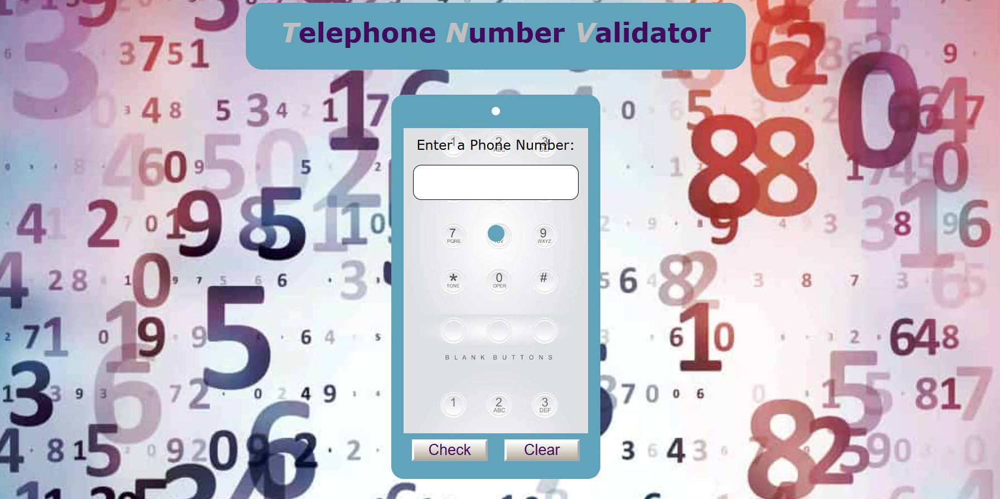

# telephone-number-validator 🚀

## Overview 📝

This project implements a simple web application to validate US phone numbers entered by users.

## Demo 📸

## Live Link 

https://faridafaqiri.github.io/telephone-number-validator/

## Features ⭐

Input Validation: Validates various formats of US phone numbers, including:
10-digit numbers (e.g., 1234567890)
Numbers with optional country code (1) and various separators (e.g.,         1-800-123-4567, (555) 555-5555).
Clear Functionality: Allows users to clear the input field and validation results.
Visual Representation: Styled with a phone-themed design using CSS, enhancing user experience.

## Technologies Used 🛠️

HTML: Provides the basic structure of the web page.
CSS: Styles the elements, including background images, colors, and layout.
JavaScript: Implements functionality to validate and display phone number validity.

## Usage 🎯

1. Enter a phone number into the input field.
2. Click the Check button to validate the number.
3. Validation results (either "Valid US number" or "Invalid US number") will be displayed.
4. Use the Clear button to reset the input field and clear the results.

## Installation 💻

To run this project locally, simply clone the repository and open the index.html file in your web browser.
  git clone <git@github.com>:faridafaqiri/telephone-number-validator.git
  
  cd telephone-number-validator

## Contributing

Contributions are welcome! If you'd like to enhance the project or report any issues, feel free to submit a pull request or open an issue in the repository.

## Author 👩‍💻

You can contact me through the following:

- LinkedIn: (<https://www.linkedin.com/in/farida-faqiri-071a31309/>)
- Email: (<farida.faqiri2@gmail.com>)
